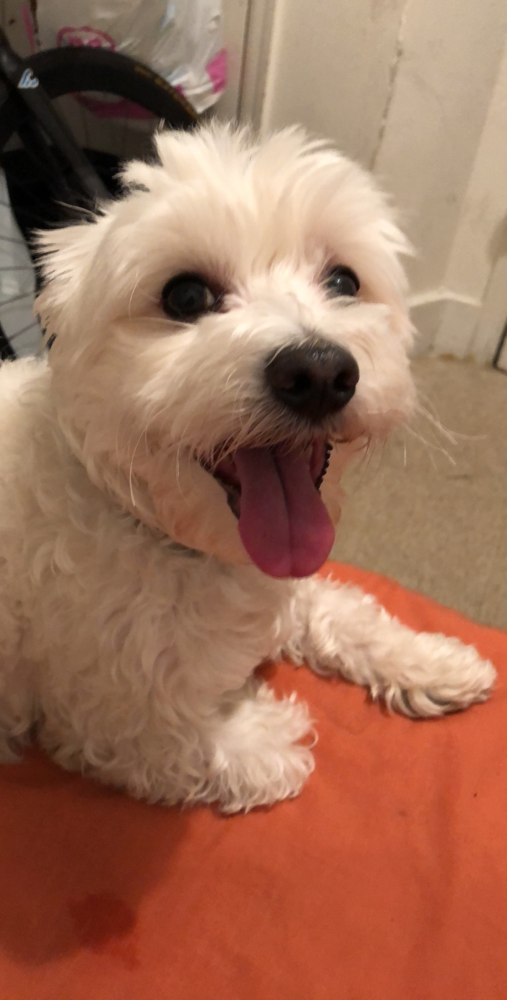
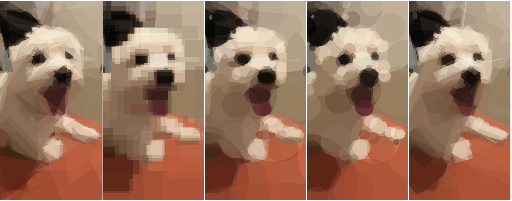
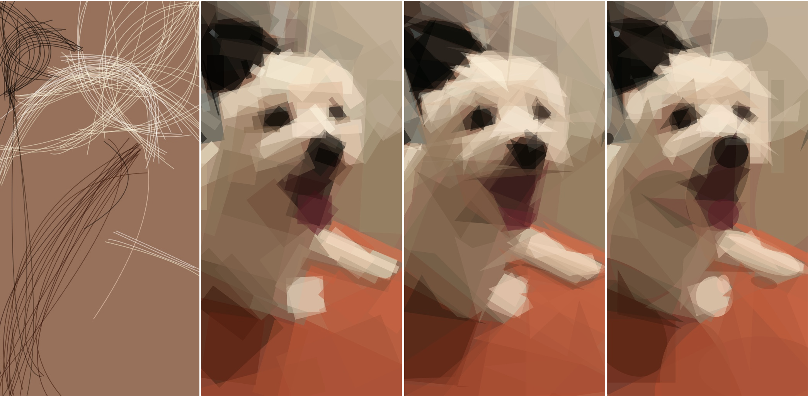

# Bluhr
Transform your images into geometric primitives using this web application

Original Photo: My dog Beckham 

Results (100 distinct shapes using various modes): 

1. Triangles           2. Rectangles         3. Ellipses               4. Circles          5. Rotated Rectangles

6. Bezier Lines
7. Rotated Ellipses
8. Polygons
9. Combination of all

